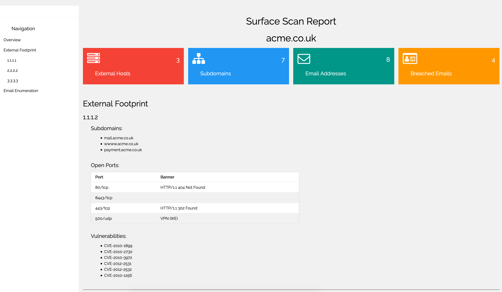
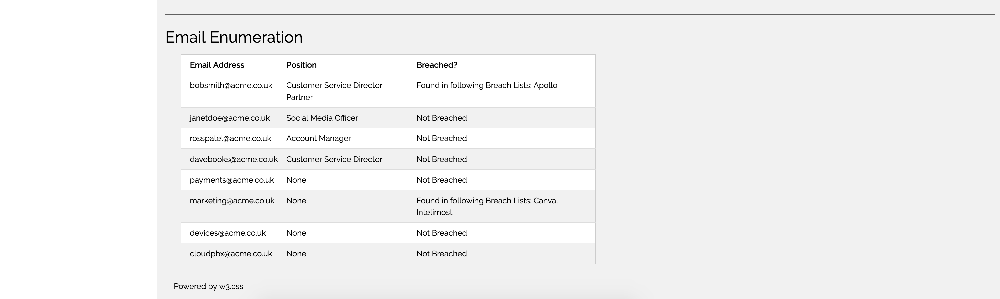

# SurfaceScan
OSINT SurfaceScan and HTML report generation tool

## Usage
```
python3 surfacescan.py -d acme.co.uk
 [!] Identifying Subdomains of: acme.co.uk
 [!] list index out of range
 [!] 20 Subdomains found
 [!] Checking Shodan
 [!] Getting Emails
 [!] Generating Report
 [!] Report created: ./Reports/acme.co.uk_SurfaceScan_report.html
```

## Requirements
To get all the benefits I recommend utilising all the API. If you do not utilise one of the below APIs the code will need to be altered to account for this.

### Minimum
HunterIO API -> Used for obtaining email address <br>
Shodan API -> Used for obtaining open ports and potential Vulns <br>
### Recommended
VirusTotal API -> Used in part to obtain subdomains <br>
Have I been Pwned API -> Used to cross check email addresses against breach lists.


## Output
Html report will be placed into the './Reports' directory. CSS files needed to be moved in line with reports if they are to be provided externally.

 
